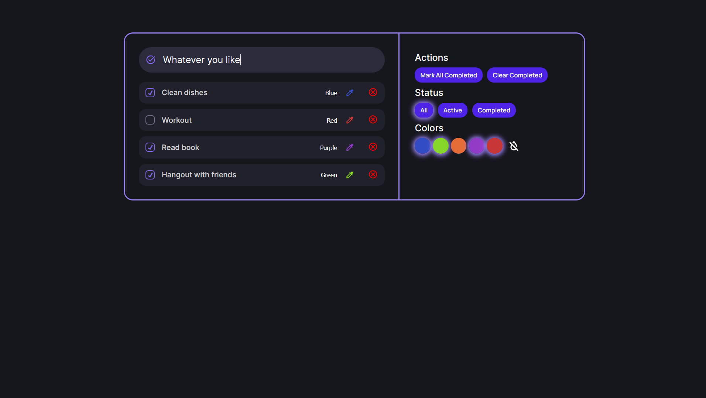

<h1 align='center'>Todo Web App</h1>



## Features

- **Add new todos**
- **Complete todo**
- **Remove todo**
- **Color filter**
- **Show only active or completed todos**
- **Complete all**
- **Remove completed**
- **Reset color filters**

## Deployment

Clone and install
```bash
git clone https://github.com/m1tyya/todo.git
cd todo
yarn
```

Run a development server
```bash
yarn dev
```
